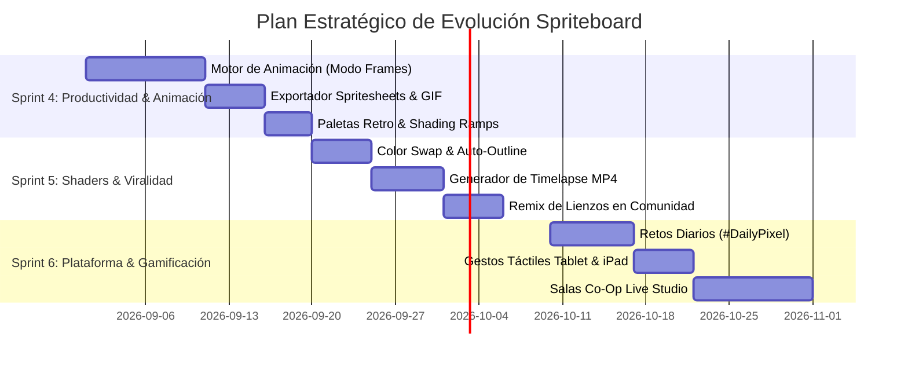

# 🚀 Spriteboard: Master Strategic Roadmap & Feature Proposals

Documento de análisis estratégico y propuestas arquitectónicas para la evolución de **Spriteboard**, diseñado para consolidar la plataforma como el ecosistema de creación de pixel art y lienzos colaborativos más potente, moderno y fluido de la web.

---

## 🧭 Resumen Ejecutivo y Matriz de Oportunidades

| # | Iniciativa | Área / Dominio | Impacto / ROI | Complejidad | Viabilidad Técnica | Sprint Recomendado |
|---|---|---|---|---|---|---|
| **1** | **Timeline & Motor de Animación (Modo Frames)** | Studio Engine | 🌟 Masivo (x10) | Media-Alta | Alta (Worker + Offscreen) | **Sprint 4** |
| **2** | **Exportador de Spritesheets & Game Engine Pack** | Game Dev Tools | 🚀 Alto | Baja-Media | Muy Alta (Cliente) | **Sprint 4** |
| **3** | **Exportador de Timelapse en Video / GIF Viral** | Social & Crecimiento | 🚀 Alto | Media | Alta (Offscreen MediaRecorder) | **Sprint 4** |
| **4** | **Gestor de Paletas Retro & Shading Ramps** | UX & Productividad | 💎 Alto | Baja | Muy Alta (Worker Array) | **Sprint 4** |
| **5** | **Herramienta Color Swap / Reemplazo Inteligente** | Herramientas Pixel | 💎 Alto | Muy Baja | Inmediata (Worker UInt32) | **Sprint 5** |
| **6** | **Generador Automático de Outlines & Sombras** | Filtros & Shaders | 🎨 Medio-Alto | Baja | Inmediata (Kernel 3x3) | **Sprint 5** |
| **7** | **Imagen de Referencia Flotante (Pin / Overlay)** | UX & Flujo Artístico | 🎨 Medio-Alto | Muy Baja | Inmediata (DOM Canvas) | **Sprint 5** |
| **8** | **Remix & Plantillas Abiertas de la Comunidad** | Viralidad / Retención | 🌟 Masivo | Baja-Media | Alta (MySQL Clone + S3) | **Sprint 5** |
| **9** | **Retos y Desafíos Diarios (#DailyPixel)** | Comunidad & Gamificación | 🌟 Masivo | Media | Alta (Cron + Feed) | **Sprint 6** |
| **10** | **Salas de Estudio Privadas (Co-Op Live Studio)** | Multiplayer / Pro | 🌟 Masivo | Alta | Media (Go WebSocket Cluster) | **Sprint 6** |
| **11** | **Gesto Táctil Multi-touch & Modo Tablet (iPad/Pen)** | Ergonomía Móvil | 📱 Alto | Media | Alta (Pointer Events API) | **Sprint 6** |
| **12** | **Portafolios de Creador & Marketplace de Assets** | Monetización / Negocio | 💰 Alto | Media-Alta | Alta (Stripe Connect + DB) | **Sprint 6** |

---

## 🎨 Pilar 1: Motor de Creación & Pixel Art de Nivel Profesional

### 1. Timeline & Motor de Animación (Modo Frames en el Carrusel Inferior)
> [!IMPORTANT]
> **El siguiente salto cuantitativo natural para Spriteboard.**
> Ya contamos con el carrusel inferior de tarjetas. Permitir alternar este carrusel entre **Modo Capas** y **Modo Frames / Animación** posicionará la web a la altura de **Aseprite** y **Piskel**.

#### 💡 Concepto
* El carrusel inferior incorpora un selector de pestañas o toggle en el footer: `[Capas | Animación]`.
* En **Modo Animación**, cada tarjeta rectangular representa un **Frame (Fotograma)**.
* Botón de **Play / Loop** con velocidad configurable (1 FPS a 60 FPS, presets a 8, 12, 24 fps).
* **Onion Skinning (Piel de Cebolla):** Muestra el fotograma anterior en azul/rojo con opacidad tenue para guiar el movimiento.
* **Exportación Directa:** Descarga como GIF animado, WebP animado o Sprite Sheet en un solo clic.

#### 🛠️ Viabilidad Técnica
* **Rendimiento:** Cada frame es un array de capas existente almacenado en memoria compacta `Uint32Array` dentro de `CanvasRenderWorker.js`.
* **Reproducción a 60 FPS:** El Web Worker puede enviar los frames directamente al `OffscreenCanvas` usando `requestAnimationFrame`.
* **Persistencia:** La estructura de datos en S3/MySQL se amplía a un JSON ligero `{ frames: [ { layers: [...] } ] }`.

---

### 2. Exportador de Spritesheets & Packs para Game Engines (Godot, Unity, Phaser, Unreal)
> [!TIP]
> Los desarrolladores de videojuegos indie buscan activamente herramientas donde puedan dibujar sus personajes y exportar directamente la hoja de sprites con metadata JSON lista para importar en Godot o Unity.

#### 💡 Concepto
* Diálogo de Exportación Avanzada:
  * **Formato:** PNG individual o **Sprite Sheet Grid** (ej. 4x4, 8x1, etc.).
  * **Escalado Inteligente Pixel-Crisp:** 1x (original), 2x, 4x, 8x, 16x, 32x (Nearest-Neighbor sin difuminados borrosos).
  * **Metadata JSON / Atlas:** Generación de archivo `.json` con coordenadas `x, y, w, h, duration` compatible con formato Aseprite/Phaser/Godot.
  * **Vector SVG:** Exportación de píxeles trazados a vectores limpios SVG.

#### 🛠️ Viabilidad Técnica
* **100% Ejecutable en Cliente:** Se procesa instantáneamente en el navegador mediante canvas temporal o en el Worker sin sobrecargar el backend.
* **Descarga via Zip:** Empaquetado instantáneo con JSZip o descarga individual.

---

### 3. Gestor de Paletas Retro & Shading Ramps (Rampas de Sombras)
#### 💡 Concepto
* **Paletas Clásicas Integradas:** Presets instantáneos reconocidos mundialmente:
  * **Game Boy Original** (4 tonos verdosos retro).
  * **PICO-8** (16 colores emblemáticos).
  * **NES / Famicom** (54 colores clásicos).
  * **Commodore 64 / CGA**.
  * **Lospec Integration:** Búsqueda o carga de paletas populares de la comunidad de pixel art en formato `.gpl` o `.hex`.
* **Auto-Shading Ramp Generator:** Al seleccionar cualquier color, el sistema calcula automáticamente una rampa de 5 tonos (2 luces, color base, 2 sombras) ajustando luminosidad y matiz (*hue shifting*), que es la técnica sagrada del pixel art.

---

### 4. Herramientas Avanzadas de Edición de Píxeles
* **Color Swap (Reemplazo Global de Color):** Con un solo clic, sustituye todos los píxeles de color `#FF0000` por `#00FF00` en la capa activa o en todo el lienzo.
* **Auto-Outline (Generador de Contornos):** Genera automáticamente un borde de 1px (negro o color a elección) alrededor de todo el contenido de la capa.
* **Auto-Shadow (Sombra Proyectada 1px):** Duplica los píxeles hacia la diagonal inferior en tono oscuro semitransparente.

---

## 🌐 Pilar 2: Crecimiento Viral, Comunidad & Red Social

### 5. Generador de Timelapse en Video / GIF para TikTok & Redes Sociales
> [!IMPORTANT]
> El contenido más viral sobre pixel art en TikTok, Instagram Reels, Twitter/X y YouTube Shorts son los videos acelerados del proceso de dibujo (*speedpaint timelapses*).

#### 💡 Concepto
* Botón en la barra superior: **"Generar Timelapse"**.
* El sistema reproduce la secuencia histórica de trazos en 10-15 segundos acelerados y graba un video MP4 / WebM optimizado a 1080p con logo sutil de la web y enlace al perfil del autor.
* El usuario lo descarga con 1 clic para subirlo a sus redes.

#### 🛠️ Viabilidad Técnica
* El historial de trazos ya existe en el stack de Undo/Redo y en el log del backend.
* Se reproduce en un canvas Offscreen a alta velocidad y se captura con la API nativa `MediaRecorder(canvas.captureStream(60))`. Cero consumo de CPU en el servidor.

---

### 6. Sistema de Remix / Fork de Lienzos
#### 💡 Concepto
* En la vista de `explore.php`, los creadores pueden marcar su lienzo como **"Permitir Remix"**.
* Cualquier usuario puede presionar el botón **"Remix"**, lo que clona el lienzo a su estudio personal como base de trabajo.
* El nuevo lienzo incluye automáticamente una insignia: *"Remix basado en @CreadorOriginal"*.

---

### 7. Retos y Desafíos Diarios (#DailyPixel)
#### 💡 Concepto
* Un panel interactivo en el Home y Explore con el **"Reto del Día"** (ej. *Día 1: Poción Mágica 32x32*, *Día 2: Mini Boss Cyberpunk*, *Día 3: Comida Retro 16x16*).
* Los usuarios crean un lienzo con el tag oficial del reto y aparecen en la pestaña especial del día.
* Sistema de votos de la comunidad con medallas digitales para el perfil del usuario.

---

## 💰 Pilar 3: Monetización, Cuentas Pro & Gamificación

### 8. Salas de Estudio Privadas (Co-Op Live Studio)
#### 💡 Concepto
* Los usuarios Pro/Studio pueden crear una sala privada con enlace de invitación o contraseña.
* Varios amigos o compañeros de equipo de un juego indie pueden dibujar en el mismo lienzo colaborativo en tiempo real con **cursores en vivo** y capas compartidas.

### 9. Perfiles de Creador Personalizados & Portafolio Integrado
#### 💡 Concepto
* Cada usuario cuenta con su enlace único: `spriteboard.app/@usuario`.
* Banner personalizado, biografía, redes sociales, colección de medallas de retos diarios y visor interactivo de sus creaciones donde los visitantes pueden hacer zoom y explorar los píxeles.

---

## 📱 Pilar 4: Experiencia Móvil, Tablets & Ergonomía

### 10. Gestos Multi-touch para Tablets y Móviles
* **Pellizcar para Zoom (Pinch-to-zoom):** Zoom natural con dos dedos.
* **Toque con 2 dedos:** Deshacer (*Undo*).
* **Toque con 3 dedos:** Rehacer (*Redo*).
* **Detección de Apple Pencil / Stylus:** Dibujo con el lápiz mientras los dedos solo mueven/panean el lienzo sin mancharlo con toques accidentales de la palma.

---

## 📅 Plan de Implementación Recomendado por Fases

